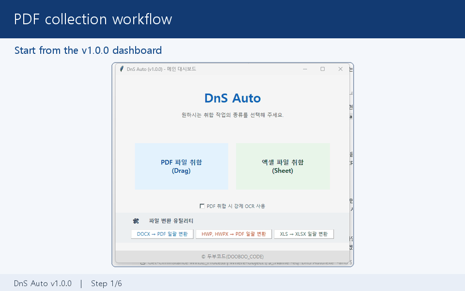
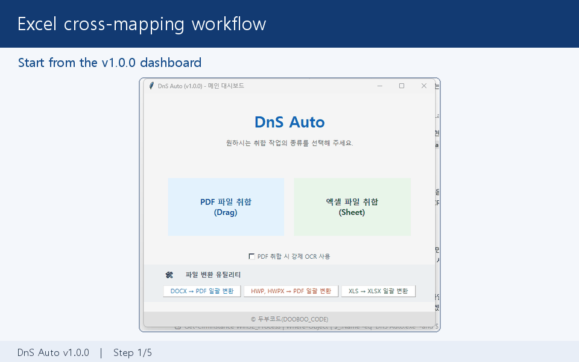

# DnS Auto v1.0.0

DnS Auto는 Windows에서 PDF·Excel 자료를 기준 양식으로 취합하고 DOCX·HWP·XLS 문서를 변환하는 로컬 데스크톱 도구입니다. PDF 내장 텍스트와 로컬 ONNX OCR을 함께 사용하며 문서 내용을 외부 서버로 전송하지 않습니다.



## 주요 기능

- PDF 영역 지정, 기준 단어 추적, 네이티브 텍스트·한국어 OCR 취합
- Excel 다중 시트 누적 취합과 기준 열 교차매핑
- DOC/DOCX·HWP/HWPX의 PDF 변환 및 XLS의 XLSX 자동변환
- GUI와 MCP가 공유하는 프로필·서비스·작업 유형별 예상시간 추정기
- 현재 시트·파일·페이지 진행 표시와 표본 부족 시 `계산 중` 표시
- GUI 창 닫기 및 MCP `cancel_job`을 통한 전체 작업 취소
- 취소 시 결과 저장 차단, 임시 결과 정리, COM·워크북·PDF 자원 해제



## 배포판 사용

GitHub Releases의 `DnS_Auto_Portable.zip`을 내려받아 전체 압축을 해제한 후 `DnS Auto.exe`를 실행합니다. MCP 연동은 같은 폴더의 `DnS Auto MCP.exe`와 `MCP_GUIDE.html`을 사용합니다.

- Windows 10/11 64비트
- DOC/DOCX 변환: Microsoft Word 필요
- XLS 변환과 구형 Excel 처리: Microsoft Excel 필요
- HWP/HWPX 변환: 한컴오피스 한글 필요

## 소스 실행

```powershell
python -m venv .venv
.\.venv\Scripts\python.exe -m pip install --upgrade pip
.\.venv\Scripts\python.exe -m pip install -r requirements.txt
.\.venv\Scripts\python.exe DnS_Auto_Main.py
```

`ocr_models` 폴더의 ONNX 모델 3개가 필요합니다. 출처와 해시는 [THIRD_PARTY_NOTICES.md](THIRD_PARTY_NOTICES.md)에 기록되어 있습니다.

## 자동 테스트

```powershell
.\.venv\Scripts\python.exe -m unittest discover -s tests -p "test_*.py" -v
.\.venv\Scripts\python.exe -B test_processing_time_estimator.py -v
.\.venv\Scripts\python.exe -B test_pdf_eta_regression.py -v
.\.venv\Scripts\python.exe -B test_sheet_xls_regression.py -v
```

## 빌드

```powershell
.\.venv\Scripts\python.exe -m pip install -r requirements-build.txt
.\.venv\Scripts\python.exe -m PyInstaller --noconfirm --clean DnS_Auto.spec
.\.venv\Scripts\python.exe -m PyInstaller --noconfirm --clean DnS_Auto_MCP.spec
```

GUI는 `dist\DnS Auto.exe`, MCP는 `dist\DnS Auto\DnS Auto MCP.exe`와 `_internal`에 생성됩니다.

## 문서

- [통합 사용자 가이드](docs/USER_GUIDE.html)
- [GUI 상세 가이드](docs/GUI_GUIDE.html)
- [GUI 빠른 시작](docs/GUI_QUICK_START.html)
- [MCP 가이드](docs/MCP_GUIDE.html)
- [변경 이력](CHANGELOG.md)
- [보안 정책](SECURITY.md)

## 개인정보와 제한사항

실제 업무문서, 결과 파일, 프로필 및 감사 로그에는 개인정보나 로컬 경로가 포함될 수 있습니다. 공개 Issue나 저장소에 첨부하지 마십시오. OCR 정확도는 스캔 품질·기울기·글꼴·영역 설정의 영향을 받으며 Office/HWP 변환은 설치된 프로그램과 보안 설정의 영향을 받습니다.

## 라이선스

Copyright (C) 2026 두부코드(DOOBOO_CODE)

이 프로젝트는 [GNU Affero General Public License v3.0](LICENSE)에 따라 배포됩니다. 제3자 구성요소에는 각 구성요소의 별도 라이선스가 적용됩니다.
